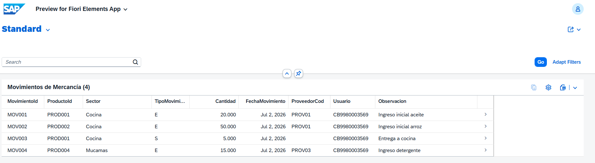
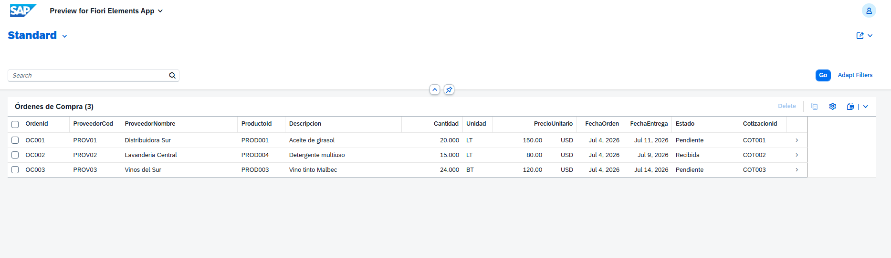
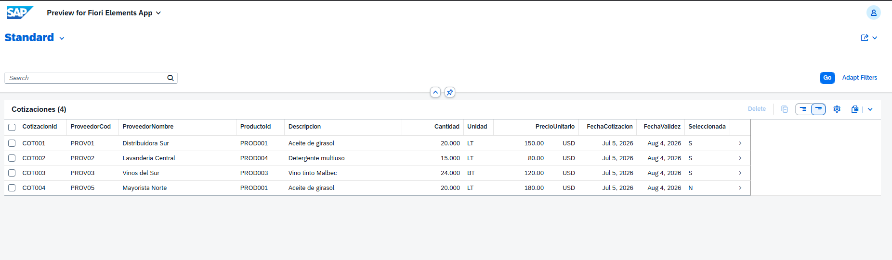

# SAP ABAP Portfolio – Hotel Management Projects

**Author:** Hugo Mayorga  
**Certification:** SAP Certified Associate – Back-End Developer (ABAP Cloud)  
**Environment:** SAP BTP ABAP Environment (Trial) | Eclipse ADT  

---

## About This Portfolio

I work in purchasing and accounting at a hotel. These projects are based on real operational workflows I manage daily, built to demonstrate SAP ABAP development skills for junior/associate consultant roles. All projects are built using the modern SAP S/4HANA Cloud development stack (RAP, CDS, Fiori Elements, OData V4) on SAP BTP ABAP Environment.

---

## Project 1 – Supplier Invoice & Payment Order Manager (FI / RAP)

### Business Context
In a hotel, every department (kitchen, restaurant, housekeeping, maintenance) generates purchase invoices from suppliers. The accounting team must track each invoice, validate it, and generate a Payment Order (OP) before marking it as paid. This project digitizes and automates that process.

### Technical Stack
- SAP RAP (Restful ABAP Programming Model)
- Core Data Services (CDS) – Interface View + Projection View
- Fiori Elements (List Report)
- OData V4
- SAP BTP ABAP Environment
- SAP S/4HANA Cloud (compatible development stack)

### Artifacts Created
| Artifact | Name | Description |
|---|---|---|
| Database Table | `ZFACTURA_PROV` | Stores supplier invoices |
| CDS Interface View | `ZI_FacturaProv` | Root view entity |
| CDS Projection View | `ZC_FacturaProv` | Fiori UI annotations |
| Behavior Definition | `ZI_FACTURAPROV` | Managed, with validations |
| Behavior Definition | `ZC_FACTURAPROV` | Projection with create/update/delete |
| Behavior Implementation | `ZBP_I_FACTURAPROV` | Business logic handler |
| Service Definition | `ZUI_FACTURAPROV` | Exposes entity |
| Service Binding | `ZUI_FACTURAPROV_O4` | OData V4, published |

### Business Logic Implemented
- **validarMonto** – Rejects invoices with amount ≤ 0
- **validarPagoConOP** – Prevents marking an invoice as "Paid" without a Payment Order number
- **calcularVencida** – Automatically sets status to "Overdue" when due date has passed

### App Screenshot

---

## Project 2 – Goods Receipt & Stock Management (MM / RAP)

### Business Context
In a hotel, goods received from suppliers (food, cleaning products, maintenance supplies) must be recorded, distributed to each sector, and tracked for expiration dates. This project digitizes that process covering stock management and goods movement recording.

### Technical Stack
- SAP RAP (Restful ABAP Programming Model)
- Core Data Services (CDS) – Interface View + Projection View
- Fiori Elements (List Report)
- OData V4
- SAP BTP ABAP Environment
- SAP S/4HANA Cloud (compatible development stack)

### Artifacts Created
| Artifact | Name | Description |
|---|---|---|
| Database Table | `ZSTOCK_HOTEL` | Hotel stock by product and sector |
| Database Table | `ZMOVIMIENTO_MERC` | Goods movements (entries and exits) |
| CDS Interface View | `ZI_StockHotel` | Root view entity for stock |
| CDS Projection View | `ZC_StockHotel` | Fiori UI annotations for stock |
| CDS Interface View | `ZI_MovimientoMerc` | Root view entity for movements |
| CDS Projection View | `ZC_MovimientoMerc` | Fiori UI annotations for movements |
| Behavior Definition | `ZI_STOCKHOTEL` | Managed stock behavior |
| Behavior Definition | `ZC_STOCKHOTEL` | Projection with create/update/delete |
| Behavior Definition | `ZI_MOVIMIENTOMERC` | Managed movements behavior |
| Behavior Definition | `ZC_MOVIMIENTOMERC` | Projection with create/update/delete |
| Service Definition | `ZUI_STOCKHOTEL` | Exposes stock entity |
| Service Binding | `ZUI_STOCKHOTEL_O4` | OData V4, published |
| Service Definition | `ZUI_MOVIMIENTOMERC` | Exposes movements entity |
| Service Binding | `ZUI_MOVIMIENTOMERC_O4` | OData V4, published |

### Business Logic Implemented
- Stock tracked by product and sector (Kitchen, Restaurant, Housekeeping, Maintenance)
- Goods movements recorded as Entry (E) or Exit (S)
- Expiration date tracking per product

### App Screenshots

---

## Project 3 – Purchasing & Payments Integration (MM / FI / RAP)

### Business Context
In a hotel, before placing a purchase order, multiple suppliers are contacted for quotes on the same product. The best quote is selected based on price and conditions, a purchase order is generated, and once goods are received and the invoice arrives, the payment order is issued. This project digitizes that complete procurement cycle.

### Technical Stack
- SAP RAP (Restful ABAP Programming Model)
- Core Data Services (CDS) – Interface View + Projection View
- Fiori Elements (List Report)
- OData V4
- SAP BTP ABAP Environment
- SAP S/4HANA Cloud (compatible development stack)

### Artifacts Created
| Artifact | Name | Description |
|---|---|---|
| Database Table | `ZORDEN_COMPRA` | Purchase orders by supplier |
| Database Table | `ZCOTIZACION` | Supplier quotations |
| CDS Interface View | `ZI_OrdenCompra` | Root view entity for purchase orders |
| CDS Projection View | `ZC_OrdenCompra` | Fiori UI annotations for purchase orders |
| CDS Interface View | `ZI_Cotizacion` | Root view entity for quotations |
| CDS Projection View | `ZC_Cotizacion` | Fiori UI annotations for quotations |
| Behavior Definition | `ZI_ORDENCOMPRA` | Managed purchase order behavior |
| Behavior Definition | `ZC_ORDENCOMPRA` | Projection with create/update/delete |
| Behavior Definition | `ZI_COTIZACION` | Managed quotation behavior |
| Behavior Definition | `ZC_COTIZACION` | Projection with create/update/delete |
| Behavior Implementation | `ZBP_I_ORDENCOMPRA` | Purchase order business logic |
| Behavior Implementation | `ZBP_I_COTIZACION` | Quotation business logic |
| Service Definition | `ZUI_ORDENCOMPRA` | Exposes purchase order entity |
| Service Binding | `ZUI_ORDENCOMPRA_O4` | OData V4, published |
| Service Definition | `ZUI_COTIZACION` | Exposes quotation entity |
| Service Binding | `ZUI_COTIZACION_O4` | OData V4, published |

### Business Logic Implemented
- Supplier quotations tracked per product with selection flag (S = Selected, N = Rejected)
- Purchase orders linked to their winning quotation via `CotizacionId`
- Order status tracked (Pending / Received) connecting to stock receipt (Project 2)
- Full procurement cycle: Quotation → Purchase Order → Goods Receipt → Invoice → Payment

### App Screenshots

---

## Project 4 – Touchless Procurement – Supply Request App

Separate repository: [sap-project4-touchless](https://github.com/HUGOOMP93/sap-project4-touchless)

Each hotel sector submits supply requests directly through a Fiori app using pre-negotiated supplier pricing. Built with SAP RAP, CDS Views, Fiori Elements and OData V4 on SAP BTP.
